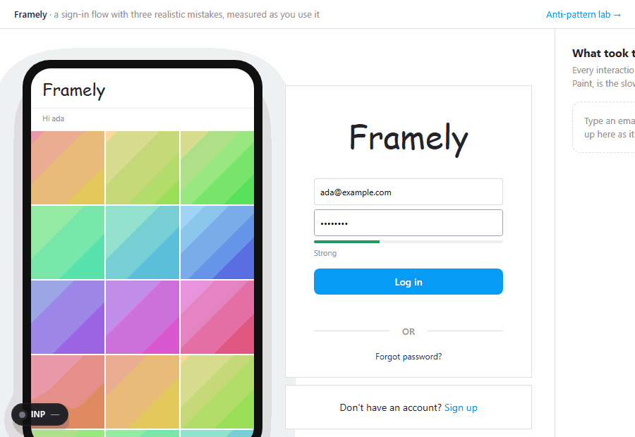

# react-inp-blame

When a click, tap or key press in your React app is slow, this names the component or the handler behind
it and says where the time went.



**[Try the demo](https://adityareddy-dev.github.io/react-inp-blame/)**. Every scenario there is slow on
purpose. Click something and read what the badge blames.

    npm install react-inp-blame

## Start with Next.js 16.3 or later

```ts
// next.config.ts
import { withInpBlame } from 'react-inp-blame/next';

// Your config first, this library's options second. They are not Next.js config keys.
export default withInpBlame({ /* your config */ }, { runtime: { overlay: true } });
```

## Start with Vite

```ts
// vite.config.ts
import { defineConfig } from 'vite';
import react from '@vitejs/plugin-react';
import { inpBlame } from 'react-inp-blame/vite';

export default defineConfig({ plugins: [react(), inpBlame({ runtime: { overlay: true } })] });
```

**What you will see.** Reload, then click something slow. A small dark badge appears in the corner,
bottom-right by default, with the page's INP so far in milliseconds: green at 200 or under, amber up to
500, red above. Click the badge for a panel of the recent slow interactions, newest first, and click a
row for the whole explanation. From the demo's sign-in page, in development:

    408 ms click on button "Log in" in SignInPage. The click handler handleLogin ran for
    about 402 ms; React's own render took under 1 ms. A second React render landed 285 ms
    after the screen updated: 84 ms re-rendering 256 components inside ProfilePage, mostly
    PhotoTile (240 of them, 73 ms). INP doesn't count it, but people still wait for it.

`overlay` takes `true` (always shown), `'query'` (shown only when the URL has `?inp-blame` or
`#inp-blame`, or `localStorage` has `react-inp-blame` set to `overlay`, which is how to open it on a
production page) or `{ position, open, max }`. Both snippets above are development-only: `enabled`
defaults to `'development'`, so a production build carries nothing from either plugin until you say
`enabled: true` or `enabled: 'production'`.

If you would rather read reports than look at a badge, drop `overlay` and subscribe:

```ts
import { onInteraction } from 'react-inp-blame';

onInteraction((report) => console.log(report.verdict, report.explanation.blame));
```

---

# Reference

Terms this page uses: **INP** (Interaction to Next Paint) is the Core Web Vital for responsiveness: how
long a click, tap or key press took to reach the next frame drawn, at the page's slowest, with the worst
few left out once a page has had many. **Event
Timing** is the browser API INP is built on. **Long Animation Frames** is a second, Chromium-only API that
says which scripts ran in a slow frame and how much layout they forced. React's **fiber tree** is the
internal tree React keeps of your rendered components; the library reads it through the hook React
exposes for developer tools. A **soft navigation** is a route change the framework makes in the page,
with no new document.

## Install with Next.js 16.3 or later

`withInpBlame(nextConfig, options)`: your Next.js config first, this library's options second. Passing the
options as the first argument throws, because Next.js has no `enabled` or `runtime` config key and would
silently drop them.

```ts
// next.config.ts
import { withInpBlame } from 'react-inp-blame/next';
export default withInpBlame({ /* your config */ }, { enabled: true, runtime: { overlay: 'query' } });
```

`withInpBlame` appends `react-inp-blame/next-client` to `instrumentationClientInject`, which Next.js imports
before `instrumentation-client` and before hydration, and adds a loader, under Turbopack and webpack, that
stamps `displayName` on the components in your `.tsx` and `.jsx` files so their names survive minification.

**`enabled` defaults to `'development'`: a production build gets neither the runtime nor the component
names unless you pass `enabled: true` or `enabled: 'production'`.**

| `enabled` | `'development'` (default) | `'production'` | `true` | `false` |
| --- | --- | --- | --- | --- |
| Runs that get the runtime and the loader | `next dev` | `next build` and `next start` | both | none: the config comes back untouched |

`runtime` is `true` (the defaults), the options for [`install()`](#installoptions), inlined through `env` and
so plain data, or `false` for the loader alone. On the App Router, reports follow soft navigations in
`navigationURL` and `navigationType`, name the one a click started in `startedNavigation`, and the INP
estimate starts over at each. The Pages Router loads the injected module too (read in Next.js 16.3.5's source,
not tested), so it gets attribution without navigations.

## Install with Vite

```ts
// vite.config.ts
import { defineConfig } from 'vite';
import react from '@vitejs/plugin-react';
import { inpBlame } from 'react-inp-blame/vite';

export default defineConfig({ plugins: [react(), inpBlame({ enabled: true, runtime: { overlay: 'query' } })] });
```

`inpBlame()` takes one argument, its own options, and returns two plugins: a module script at the top of each
HTML page that calls `install()`, so React registers with the library's hook whatever your entry imports
first, and the `displayName` transform. Add it beside your React plugin, not instead of it.
`enabled` defaults to `'development'` here too (the dev server; `'production'` is `vite build`, `true` both,
`false` adds no plugins), `runtime` is as for Next.js, and `pages(path)` picks the pages that get the script.
With another bundler, make `import 'react-inp-blame/auto'` the first import of your entry module; for names,
`react-inp-blame/display-names-loader` is a webpack-style loader with a `stamp(code)` export.

## With web-vitals

`react-inp-blame/web-vitals` gives the [web-vitals](https://github.com/GoogleChrome/web-vitals) package
React component names, in one option. It imports nothing from web-vitals, and `generateTarget` works with
no `install()` at all: it only reads the fiber React leaves on the node.

```ts
import { onINP } from 'web-vitals/attribution';
import { generateTarget } from 'react-inp-blame/web-vitals';

onINP(send, { generateTarget });
// attribution.interactionTarget: 'ProfilePage > PhotoTile (button.tile)'
```

```tsx
'use client'; // Next.js: useReportWebVitals reports the build without attribution, so add the React side
import { useReportWebVitals } from 'next/web-vitals';
import { attributeINP } from 'react-inp-blame/web-vitals';

export function WebVitals() {
  useReportWebVitals((metric) => {
    send(metric.name === 'INP' ? { ...metric, attribution: attributeINP(metric) } : metric);
  });
  return null;
}
```

The component path goes into `attribution.interactionTarget`, where web-vitals otherwise puts a CSS
selector, so it shows up wherever that field is already collected and charted, with nothing to change
downstream. A path names at most four components, and they are the four nearest the element, so in a deep
tree it starts below the page and the layout rather than ending short of the component that renders what
was clicked. `generateTarget` returns `undefined` when the node has no React fiber or no named component
above it, which is web-vitals' signal to fall back to its own selector, and it never throws.

`attributeINP(metric)` returns the metric's attribution (`{}` where there is none, as under
`useReportWebVitals`) with a `react` field added: `{ schemaVersion, interactionId, blame, handler,
hotPath, components, commits, followUps }`, frozen, from this library's own report for that interaction.
It is `null` when nothing is installed on the page, and when there is no report for the interaction:
one that stayed under `threshold` and set off no later render, or one already pushed out of the 50
reports a page keeps. It never guesses, and like `generateTarget` it never throws: a metric it cannot
read gives `react: null` rather than an exception inside your analytics callback. web-vitals keeps
everything else it owns: which interaction is
the page's INP, at what percentile, over the back/forward cache and soft navigations.

Component names in production need the `displayName` transform (the Next.js wrapper, the Vite plugin or
the loader, all above). Without it the minifier has renamed them and the path reads `a > b (button.tile)`.

## The badge and panel

`overlay: true`, in `runtime` or `install()`, shows a corner badge with the page's INP so far, green, amber or
red. Click it for the recent slow interactions, newest first, each with what to blame and a bar split into
waiting, working and updating the screen; a row opens into the full explanation and the components that
rendered before and after the paint. `overlay: 'query'` shows it only when the URL has `?inp-blame` or
`#inp-blame`, or `localStorage` has `react-inp-blame` set to `overlay`: that is how to open it on a production
page. `{ position, open, max }` sets the corner, whether the panel starts open and how many rows it keeps
(20). It is plain DOM in a shadow root, so it never causes a React render, and its code is a chunk loaded
after `install()` returns, only when shown. `mountOverlay(options)` shows it after an `/auto` import.

## API

```ts
import { onInteraction } from 'react-inp-blame';
// explanation.blame and explanation.rating are data; verdict is display text.
const stop = onInteraction((report) => console.log(report.explanation.blame, report.verdict));
```

`onInteraction(fn)` is the one way to hear reports: `fn` gets each report, and every later revision of it,
in a task after the one that published it, and the call returns the unsubscribe. A panel that renders what
it hears is safe, because the update a listener makes while it runs is never read as part of an
interaction. An update it schedules for later, with setTimeout or an await, is an ordinary render. The
package's types document every field.

### install(options)

It has to run before react-dom loads, which the plugins and `/auto` see to, and it installs once per page. A
later call, from any copy of the package, returns the same API and applies `overlay`; other options keep
their first value, with a warning, until `dispose()`.

| Option | Default | |
| --- | --- | --- |
| `overlay` | `false` | `true`, `'query'` or `{ position, open, max }` |
| `threshold` | `40` | Report interactions from this many ms; shorter ones only when a heavy later render joins them |
| `labels` | `'auto'` | Where `target.label` comes from: see [Labels and personal data](#labels-and-personal-data) |
| `hook` | `'auto'` | `'chain'` wraps an existing `__REACT_DEVTOOLS_GLOBAL_HOOK__` and never creates one; `'shim'` creates one unless one exists; `'auto'` chains or creates |
| `sampleRate` | `1` | Share of page loads that install anything |
| `walkBudget` | `5000` | Component fibers visited per commit |
| `inputWindow` | `1500` | Commits more than this many ms after the last input are not walked |
| `devtoolsTrack` | `true` | Draw each report in Chrome's Performance panel, in an "Interaction blame" track |
| `debugGlobal` | `false` | `true` puts the API on `window.__REACT_INP_BLAME__`; a string names the property |

The API has `reports()` (the last 50 published, oldest first, at their latest revision), `last()`, `inp()`
(`{ value, rating, interactionId, interactionCount, report }` for this navigation, or null), `onInteraction(fn)`,
`clear()` (drops reports and commits, and starts the INP estimate over), `dispose()` and `stats()`: `mode`
(`'shim'`, `'chained'`, `'none'`, `'unsupported'` or `'sampled-out'`), `unsupportedReason`, `walks`, and the
library's own time in `walkTotalMs`, `reportTotalMs` and `installMs`. `debug.commits()` and `debug.hook()` are
for debugging and may change in any version. Also exported: `mountOverlay`, `fiberFromNode`, `ownerChain` and
`handlerName`. Under the `react-server` condition every export does nothing, here and on
[`react-inp-blame/web-vitals`](#with-web-vitals): `generateTarget` returns `undefined` and
`attributeINP` returns `{ react: null }`.

### InteractionReport

```ts
interface InteractionReport {
  schemaVersion: 1; interactionId: number; revision: number; type: string; // 'click', 'keydown', ...
  start: number; end: number; duration: number; holdMs: number;             // ms, performance.now() clock
  inputDelay: number; processing: number; walkMs: number; presentation: number; // add up to duration
  target: TargetInfo | null; entries: EventEntrySummary[]; // target: selector, label, component, owners, handler
  navigationURL: string; navigationType: NavigationType; // web-vitals' names and values
  startedNavigation: { url: string; type: 'push' | 'replace' | 'traverse' } | null;
  commits: CommitSummary[]; followUps: CommitSummary[];   // before the paint; after it, within 1.5 s
  frames: FrameSummary[] | null; laterFrames: FrameSummary[] | null; // null without Long Animation Frames
  overheadMs: number;                                    // this library's own time on the interaction
  explanation: {
    blame: { kind: 'render' | 'handler' | 'waiting' | 'painting' | 'script' | 'none'; name: string | null;
             detail: string | null; ms: number | null; confidence: 'measured' | 'inferred' };
    rating: 'good' | 'needs-improvement' | 'poor'; phases: { label: string; ms: number; hint: string }[];
    headline: string; where: string | null; cause: string; notes: string[];
  };
  verdict: string;
}
```

`target.handler` is the name of the function on the element's event prop, or the prop's own name when that
function has no name worth printing. An inline `onClick={() => ...}` therefore reads as `onClick`, and so
does a handler the minifier renamed: name the function if you want the report to name it.

`duration` is the longest single Event Timing entry, as web-vitals measures it; `holdMs` is how much longer
the span from press to release ran. Reports are frozen: a late entry, frame or render that joins one reaches
listeners as a new object with `revision` one higher, and `schemaVersion` changes when a field is removed or
changes meaning. **`verdict`, `cause`, `notes`, `headline`, `where` and the phases' `label` and `hint` are
display text that may change between versions**; the blame, the rating, the phases' `ms` and the report's
numbers are the data. `confidence` is `'measured'` when the blame follows from this interaction's own timings,
and `'inferred'` when it rests on render counts, a clock too coarse to time one component, a commit that only
overlapped, a walk cut short, or no Long Animation Frames to rule other scripts out.

## The INP estimate

`inp()` and the badge estimate INP the way web-vitals' `onINP` does, without depending on web-vitals: each
interaction's latency is its longest Event Timing entry, and INP is the one at index
`min(floor(count / 50), n - 1)` among the `n` longest it kept, `n` at most 10, chosen as entries arrive
and again when the page is hidden, the two moments web-vitals chooses at. It starts over at each soft
navigation and back/forward cache restore, and after one of those, interactions the browser counted but no
entry was sent for read as the same 8 ms web-vitals reports for them. `apps/demo/e2e/inp.spec.ts` runs
web-vitals 6.2.2's `onINP` in the same page (`reportAllChanges`, `durationThreshold: 16`) through more
than 50 interactions and asserts after
each that both name the same value and the same interaction. That is one session, not a promise: this is the
same algorithm written again from the same entries, and it is not web-vitals. The two part at the default 40 ms
threshold, which `useReportWebVitals` keeps, when INP is under 40 ms or too few interactions reach it; at a
soft navigation; after `clear()`; for a moment after each interaction, while web-vitals waits for an idle
page; and against the older web-vitals that Next.js 16.3 vendors, which keeps counting every interaction
since the page loaded after a back/forward cache restore.

## Compared with other tools

| | react-inp-blame | Sentry `reactComponentAnnotation` | react-scan | web-vitals attribution | React 19.2 Performance tracks |
| --- | --- | --- | --- | --- | --- |
| Production-safe | yes¹ | yes | no² | yes | no: development and profiling builds |
| Names the rendered subtree, not just the target's owner | yes | no³ | yes | no: a CSS selector | yes, in development⁴ |
| Follow-up renders after the paint | yes | no | not told apart⁵ | no | drawn, not joined to the interaction |
| Forced-layout split | yes, with Long Animation Frames | no | no: reads no Long Animation Frames | partly⁶ | no |
| Plain-language verdict | yes | no | no | no | no |
| Zero dependencies | yes | no | no (11 in 0.5.7) | yes | part of React |
| Needs a build step for names | in production builds: the plugins add it | yes | not in development⁷ | no names | not in development |

1. It fails closed on a browser or React it does not know, and `sampleRate` limits the page loads it runs on. The plugins leave it out of production builds unless `enabled` says otherwise.
2. It does not start when every React renderer on the page is a production build, unless `dangerouslyForceRunInProduction` is set, which its README calls "not recommended".
3. Its build step puts `data-sentry-component` on the outermost element each component returns, and the SDK names an INP span from the target and at most four of its ancestors, using those names where it finds them.
4. Profiling builds list only components under a `<Profiler>`, or every component with the React Developer Tools extension enabled.
5. It keeps every fiber render from the pointerup or keydown as one set, until the interaction's Event Timing entry arrives or a second after the frame that follows the input.
6. `totalStyleAndLayoutDuration`, and `longestScript.entry`, which carries `forcedStyleAndLayoutDuration`.
7. It ships bundler plugins under `react-scan/react-component-name/*`; what they match was not checked.

Checked on 2026-09-15 against aidenybai/react-scan at 0fb3186, getsentry/sentry-javascript at 7267c25,
reactjs/react.dev at f7f4524 and web-vitals 6.2.2's types. In development, React's Components track is the
better source of per-component durations; what this library adds there is the join and the sentence.

## Browser support

| | Chromium | Firefox | Safari |
| --- | --- | --- | --- |
| Event Timing `interactionId` (required) | 96 | 144 | 26.2 |
| Long Animation Frames: scripts and forced layout | 123 | no | no |
| Performance panel tracks | 128 | no | no |

Without `interactionId` nothing installs, one warning says why, and `stats().mode` is `'unsupported'`. Without
Long Animation Frames, `frames` and `laterFrames` are `null` and the explanation leaves out the forced-layout and
script sentences. On a page without cross-origin isolation, Playwright's Firefox 148 and WebKit 26.4 step
`performance.now()` in whole milliseconds, too coarse to time a quick component: when eight or more of a
commit's components are timed, every one reads a whole millisecond and they average under 4 ms, the report
leaves their times out and blame built on render times is `'inferred'`.

## What it costs

Measured 2026-09-15 on 7917366 in the demo's context storm (a click re-rendering 801 components) and big list
(a keystroke re-rendering 1441), in Chromium 147 headless on an otherwise idle Windows PC: 30 fresh page loads
per scenario, one interaction each, `walkBudget: 100000`, taken
[as the design notes describe](docs/interaction-attribution-design.md#what-it-costs). p50 / p95 in ms:

| | Context storm, production | Big list, production | Context storm, development | Big list, development |
| --- | --- | --- | --- | --- |
| `install()`, both calls the demo makes | 0.5 / 0.6 | 0.5 / 0.7 | 0.6 / 0.7 | 0.6 / 0.8 |
| Walk of the commits joined to the report | 0.8 / 0.9 | 1.2 / 1.4 | 0.9 / 1.3 | 2.9 / 3.2 |
| Event Timing callback, the page's listeners included | 1.0 / 1.2 | 1.0 / 1.2 | 1.1 / 1.4 | 1.1 / 1.4 |
| Library time outside the walks (`stats().reportTotalMs`) | 0.9 / 1.2 | 1.0 / 1.3 | 0.8 / 1.1 | 0.9 / 1.2 |
| `overheadMs` of the report | 1.3 / 1.5 | 1.7 / 1.9 | 1.5 / 1.9 | 3.4 / 3.8 |

On the same machine with other processes at 15 to 49% CPU, the same commit read 1.1 to 1.6 times these p50s.
The walk runs inside React's commit and its time is taken back out of `processing`; outside an interaction a
commit costs a renderer lookup and one subtraction, and at the default `walkBudget` of 5000 neither scenario is
cut short. With `enabled` at its default, neither plugin adds anything to a production build; where it loads:

| Bundle (rolldown 1.2.8, minified ESM) | Minified | Gzip |
| --- | --- | --- |
| `react-inp-blame/auto`: everything that loads with the page | 39.0 KB | 14.4 KB |
| The badge and panel, a chunk loaded only when shown | 11.2 KB | 4.2 KB |
| Of that, the part that has to run before react-dom, not a separate entry yet: the hook, the fiber reading, the observers | 14.5 KB | 5.8 KB |
| `react-inp-blame/web-vitals` on its own, measured 2026-09-19 by a different script that read `/auto` at 38.2 / 14.1 | 2.7 KB | 1.3 KB |

## What it reads from React

These are React internals with no promise of stability, so the library checks them and fails closed: a
react-dom outside 17 to 19, a first `root.current` of another shape, or a walk that throws stops that
react-dom being read, for good, with one warning and `stats().unsupportedReason`. The page is only
`stats().mode === 'unsupported'` when no react-dom on it can be read, so an embedded widget that brought
its own React does not switch off the app's own. Reports carry on without components.

- `window.__REACT_DEVTOOLS_GLOBAL_HOOK__`: created with `inject`, `onCommitFiberRoot`,
  `onPostCommitFiberRoot`, `renderers`, `supportsFiber` and a `reactInpBlame` marker, or, when one exists,
  those three methods wrapped and its `renderers`, `isDisabled` and `supportsFiber` read.
- What react-dom hands `inject()`: `version`, `bundleType`, `rendererPackageName`. What React passes
  `onCommitFiberRoot`: the renderer id, the root, the priority and `didError`.
- On the root: `current`, and `pendingLanes`, the bits of the updates React has not committed yet. They say
  which commits the page's own report listeners caused while they ran, so a panel that shows reports is not
  read as part of one. An update a listener defers to a later task is an ordinary render and is read like
  any other.
- On fibers: `tag` (components are 0, 1, 11, 14 and 15; the root is 3, a Suspense boundary 13), `flags` (the
  `PerformedWork` bit, 1), `mode` (the `ProfileMode` bit: 8 on React 17, 2 on 18 and 19), `child`, `sibling`,
  `return`, `alternate` (the same `child` there means the fiber bailed out), `actualDuration`, `elementType`
  and `type` (for names: `displayName` or `name`, through `render` for forwardRef and `type` for memo),
  `memoizedProps` (the event's handler prop, such as `onClick`) and `memoizedState` (whether a root or a
  boundary was still server-rendered HTML: `isDehydrated` and `dehydrated`). On DOM nodes: React's
  `__reactFiber$` key.

Supported: react-dom 17, 18 and 19; only react-dom commits are walked. CI runs the demo's suites on React 19.3
in development and production builds, its attribution spec on React 18.3.1 and 17.0.2 (legacy root), and the
Next.js check on 16.3.5 under `next dev` and both production bundlers, and on `next@canary`, whose App Router
brings a React canary, on every push and once a day, in a job allowed to fail. It also installs the package as
packed for npm into apps with no peers, with Next.js 15, with Next.js 16.3.5 and with Vite 5, on Node 20.19, the
oldest its `engines` allows, and imports and requires every subpath there; the canary job installs it beside
`next@canary` as well. No job runs `react@canary` alone.

## Known limits

- **React DevTools loaded after the library is locked out, and nothing can detect it**: it installs nothing
  over an existing hook. The extension loads first, so there the library chains; the lockout takes a page that
  installs React DevTools later, like react-devtools-inline's `initialize()`. `hook: 'chain'` never creates it.
- **An interaction after the page's first input that paints in under 16 ms gets no report**, however heavy the
  render after it: the browser sends no Event Timing entry for it. The first input still arrives as a
  `first-input` entry. See "Quiet interactions" in the [design notes](docs/interaction-attribution-design.md).
- React 18 and 19 development builds print "Download the React DevTools" on pages where the library created the
  hook: it has no `checkDCE`, which react-dom takes to mean React DevTools is there.
- **Hydration is joined to an input only when React hydrated inside that input's dispatch**, which is what
  React does for a click on a boundary that has not hydrated yet; the commit then says it hydrated rather
  than re-rendered. A hydration that merely follows a keystroke is nobody's interaction and is left out.
- On React 17, which calls nothing after a commit's effects, a render set off by an effect of your report
  listener's own render can still join a report. On React 18 and 19 it cannot.
- **A render your report listener causes is recognised by the lane React put it on**, and React has one lane
  for each priority. An update of the app's own that lands on the same lane before React commits is rendered
  in that same commit and left out with it, which for an otherwise quiet interaction can mean no report.
- Production React records no durations, so blame there rests on render counts and is `'inferred'`
  (`react-dom/profiling` gives durations), and minified handlers are named by their prop.
- The names loader matches `function Foo(` and `const Foo = memo(` or `forwardRef(`, exported or not, at the
  start of a line; arrow functions, classes and `memo<Props>(` keep their minified names.
- Waiting on the server is not a phase: the render showing the result joins as a later render within 1.5 s of
  the input, or not at all.

## Labels and personal data

`target.label` names the element by its tag and a name of at most 40 characters, and never reads a form
field's value or an element's whole text. Under a production build of React it uses only what your code
wrote on the element:
`aria-label`, a form field's `placeholder`, `name` or `type`, or `data-testid` or `data-test`. An element's
text can be a person's name or email, and reports are made to be forwarded to error trackers and analytics, so
text is opt-in there: with `install({ labels: 'text' })` an element with no `aria-label` that is not a form
field is named by its first run of text. Development builds use text by default. Whatever `labels` says,
`target.selector` has the tag, the `id` if there is one, and `data-test` or `data-testid` or else two classes,
and `navigationURL` and `startedNavigation.url` are full URLs, query string included.

[Design notes](docs/interaction-attribution-design.md) · [Changelog](CHANGELOG.md) · [Contributing](CONTRIBUTING.md) · [Security](SECURITY.md) · MIT license
