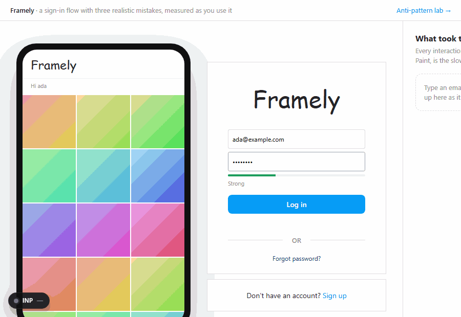

# react-inp-blame

When a click, tap or key press in your React app is slow, this names the component or the handler behind
it and says where the time went.

On two open-source apps it hadn't seen, hyperdx and kaneo, 0.25.0 was right on 8 of 62 verdicts. Of the other 54,
35 were wrong and 19 misleading. Nothing after 0.25.0 has been run on fresh apps yet, and the
[accuracy page](docs/benchmarks/real-apps.md) has how they were graded.



**[Try the demo](https://adityareddy-dev.github.io/react-inp-blame/)**. Every scenario there is slow on
purpose. Click something and read what the badge blames.

    npm install react-inp-blame

## Start with Next.js 14.2 or later

```ts
// next.config.ts
import type { NextConfig } from 'next';
import { withInpBlame } from 'react-inp-blame/next';

const nextConfig: NextConfig = {
  /* config options here */
};

// Your config first, this library's options second. They are not Next.js config keys.
export default withInpBlame(nextConfig, { runtime: { overlay: true } });
```

On Next.js 15.3 to 16.2, add one line to `instrumentation-client.ts` as well. `withInpBlame` prints it
until the file has it (14.2 to 15.2 need nothing more):

```ts
// instrumentation-client.ts
export { onRouterTransitionStart } from 'react-inp-blame/next-client';
```

Next.js 14.2 reads no `next.config.ts`, since that came in 15, so there the same setup goes in
`next.config.mjs`, as plain JavaScript:

```js
// next.config.mjs
import { withInpBlame } from 'react-inp-blame/next';

/** @type {import('next').NextConfig} */
const nextConfig = {
  /* config options here */
};

// Your config first, this library's options second. They are not Next.js config keys.
export default withInpBlame(nextConfig, { runtime: { overlay: true } });
```

## Start with Vite

```ts
// vite.config.ts
import { defineConfig } from 'vite';
import react from '@vitejs/plugin-react';
import { inpBlame } from 'react-inp-blame/vite';

export default defineConfig({ plugins: [react(), inpBlame({ runtime: { overlay: true } })] });
```

React Router in framework mode, Remix, TanStack Start and Astro write their own HTML, which this plugin
never sees on its own, so each has a setup of its own: [React Router](docs/install.md#install-with-react-router),
[Remix](docs/install.md#install-with-remix), [TanStack Start](docs/install.md#install-with-tanstack-start), [Astro](docs/install.md#install-with-astro).

**What you will see.** Reload the page. A small dark badge sits in the corner, bottom-right by default,
and reads `INP —` until you interact. Click something slow and it shows the page's INP so far in
milliseconds: green at 200 or under, amber up to 500, red above. Click the badge for a panel of the recent
slow interactions, newest first, and click a row for the whole explanation. A click, tap or key press of
40 ms or more gets a row (the `threshold` option), so a 150 ms click has one, though the badge stays green
and the panel says Good: INP counts anything up to 200 ms as good. The demo above sets
`position: 'bottom-left'`, which is why its badge sits on the left: its own explanation column has the
right-hand side. From the demo's sign-in page, in development, this is `report.verdict`, which the row
spreads over its header and body:

    400 ms click on button "Log in" in SignInPage. The click handler handleLogin ran for
    about 399 ms; React's own render took under 1 ms. A second React render landed 295 ms
    after the screen updated: 81 ms rendering 260 components from SignInDemo down, 241 of them
    inside ProfilePage, mostly PhotoTile (240 of the 260, 72 ms). INP doesn't count it, and
    what started it can't be told.

`overlay` takes `true` (always shown), `'query'` (shown only when the URL has `?inp-blame` or
`#inp-blame`, or `localStorage` has `react-inp-blame` set to `overlay`, which is how to open it on a
production page) or `{ position, open, max }`. In a shared repo each developer can press Hide for me in
the panel, which keeps the badge off in that browser until the page is opened with `?inp-blame`, or the
repo can use `'query'` and each developer opts in with the `localStorage` line. Both snippets above are
development-only: `enabled` defaults to `'development'`, so a production build carries nothing from
either plugin until you say `enabled: true` or `enabled: 'production'`. So `vite preview` and
`next start`, which serve a production build, show no badge by default, and the build prints a line
saying it left the library out. The line on Next.js 15.3 to 16.2 stays in every build, but compiles to
nothing in the ones `enabled` leaves out.

**Numbers in development.** It is a development tool first, so most numbers you see come from React's
development build, which is slower than production, and under `<StrictMode>` React renders every component
twice there. The badge rates what it measured on the same scale, marks the build `dev`, and the panel says to
check anything amber or red in a production build: add `enabled: true` and `runtime: { overlay: 'query' }`,
run `next build` and `next start` or `vite build` and `vite preview`, and open the page with `?inp-blame`
([Numbers in development](docs/install.md#numbers-in-development)).

If you would rather read reports than look at a badge, drop `overlay` and subscribe:

```ts
// Next.js: instrumentation-client.ts or any client module. Vite: the entry module.
import { onInteraction } from 'react-inp-blame';

// A report can come again as a later revision when more data joins it: keep the latest per interactionId.
onInteraction((report) => console.log(report.verdict, report.explanation.blame));
```

To read the whole report of the last interaction in the console, add `debugGlobal: true` to `runtime` and
run `__REACT_INP_BLAME__.last()`.

<a id="reporting-a-wrong-blame"></a>

## When the blame is wrong

If a report names the wrong component or handler, or a slow interaction gets no report at all, please open
an issue with the [wrong or missing blame form](https://github.com/adityareddy-dev/react-inp-blame/issues/new?template=wrong-or-missing-blame.yml).
The report itself is what makes it diagnosable. Add `debugGlobal: true` to `runtime` (or to `install()`) and
run `JSON.stringify(__REACT_INP_BLAME__.last(), null, 2)` in the console right after the slow interaction, or
print `JSON.stringify(report)` from `onInteraction`; with no report, paste `stats()` instead. What the badge
shows is a good start, but the JSON has everything its sentence was built from.

The form also asks for the versions of react-inp-blame, react and react-dom, and Next.js or Vite, the bundler,
whether it was a development or a production build, and the browser. Each changes what a report can say: a
production build of React records no render times, and only Chromium has Long Animation Frames. A report
carries the page's origin and path and the label of the element you clicked, so read it through before you
paste it.

These reports are how the blame gets better. If the console printed a warning instead, it ends with a link to
its entry under [Troubleshooting](#troubleshooting).

---

## Compared with other tools

| | react-inp-blame | Sentry `reactComponentAnnotation` | react-scan | web-vitals attribution | React 19.2 Performance tracks |
| --- | --- | --- | --- | --- | --- |
| Runs in a production build | optional¹ | yes | not its main entry² | yes | no: development and profiling builds |
| Names the rendered subtree, not just the target's owner | yes | no³ | yes | no: a CSS selector | yes, in development⁴ |
| Follow-up renders after the paint | yes | no | not told apart⁵ | no | drawn, not joined to the interaction |
| Forced-layout split | yes, from Long Animation Frames, and it can be the verdict rather than a footnote | no | no: reads no Long Animation Frames | partly⁶ | no |
| Plain-language verdict | yes | no | no | no | no |
| Zero dependencies | yes | no | no (11 in 0.5.7) | yes | part of React |
| Needs a build step for names | in production builds: the plugins add it | yes | not in development⁷ | no names | not in development |

1. A development tool first: the plugins leave it out of production builds unless `enabled` says otherwise. Turned on there, it fails closed on a browser or React it does not know, and `sampleRate` limits the page loads it runs on. In 0.12.0 that cost about 209 ms of page load on the shadcn/ui docs site, and about 5 ms inside each interaction on the twenty CRM ([What it costs](#what-it-costs)).
2. Its main entry does not start when every React renderer on the page is a production build, unless `dangerouslyForceRunInProduction` is set, which its README calls "not recommended". Two other entries in 0.5.7 run there anyway: `react-scan/all-environments` skips that check, and `react-scan/lite`, a headless one, attaches to every renderer whatever its build.
3. Its build step puts `data-sentry-component` on the outermost element each component returns. Since 11.0.0 the SDK, with span streaming (its default), names an INP span after the first of those on the target or its four nearest ancestors, or `Click` or `Key press` when there is none, and keeps the DOM path in `browser.web_vital.inp.target`.
4. Profiling builds list only components under a `<Profiler>`, or every component with the React Developer Tools extension enabled.
5. It keeps every fiber render from the pointerup or keydown as one set, until the interaction's Event Timing entry arrives or a second after the frame that follows the input.
6. `totalStyleAndLayoutDuration`, and `longestScript.entry`, which carries `forcedStyleAndLayoutDuration`.
7. It ships bundler plugins under `react-scan/react-component-name/*`; what they match was not checked.

Checked on 2026-09-26 against aidenybai/react-scan at 0fb3186 (0.5.7 on npm), getsentry/sentry-javascript at
bd3ce5f (11.0.0), reactjs/react.dev at 44b0b5f and web-vitals 6.2.2's types. In development, React's Components track is the
better source of per-component durations, and react-scan's notifications already tie a slow interaction to the components
that rendered for it. Its `all-environments` entry starts the same tracking in a production build. What this library adds
is Long Animation Frames' forced layout inside that join, in either build, and the sentence.

## Browser support

| | Chromium | Firefox | Safari |
| --- | --- | --- | --- |
| Event Timing `interactionId` (required) | 96 | 144 | 26.2 |
| Long Animation Frames: scripts and forced layout | 123 | no | no |
| Performance panel tracks | 128 | no | no |

Without `interactionId` nothing installs and `stats().mode` is `'unsupported'`. One warning says why: always in
a development build, and in a production build on the pages `sampleRate` takes. A production page the sample
leaves out prints nothing, so a tool that forwards console warnings gets no event from it. Without Long
Animation Frames, `frames` and `laterFrames` are `null` and the explanation leaves out the forced-layout and
script sentences. On a page without cross-origin isolation, Playwright's Firefox 148 and WebKit 26.4 step
`performance.now()` in whole milliseconds, too coarse to time a quick component: when eight or more of a
commit's components are timed, every one reads a whole millisecond and they average under 4 ms, the report
leaves their times out and blame built on render times is `'inferred'`.

## Versions

| | CI runs | Outside that |
| --- | --- | --- |
| react-dom | 17.0.2, 18.2.0, 18.3.1, 19.0.0, 19.1.9, 19.2.8, 19.3.0, and the canary `next@canary` brings | Outside 17 to 19 that root is not read, and [one warning](docs/troubleshooting.md#react-version) says so |
| Next.js | 14.2.35, 15.3.9, 15.5.26, 16.2.12, 16.3.5 and canary | Below 14.2 the wrapper leaves the config as it was and [says why](docs/troubleshooting.md#next-too-old) |
| Vite | 6.4, 7.3 and 8.3; a build on Vite 5 | Not tried below 5 |
| React Router, Remix, TanStack Start | React Router 7.18 and 8.4, Remix 2.17 on Vite, TanStack Start 1.168 | Not tried |
| Astro | 7.3 | Not tried |
| [webpack](docs/install.md#webpack-or-rspack) | 5.111 | Not tried |
| Node, for the build plugins | Installs and loads on 20.19, tests on 22 and 24 | `engines` asks for 20.19 |

The peer dependencies are all `*` and optional, on purpose. npm refuses to install beside a prerelease that a
range leaves out, even for an optional peer, and `next@canary` or a React canary is a prerelease of a version no
range written today can name. So a real range would stop those installs with an ERESOLVE error, where the library
itself says what is wrong: the Next.js wrapper checks the version at build time, and `install()` checks each
react-dom as it registers.

**Under Jest.** The package is ES modules only, and Jest's default runtime loads everything as CommonJS, so a
test that reaches it fails with "Cannot use import statement outside a module" (from Jest 30.5, "Must use import
to load ES Module") unless Jest compiles it first. With `next/jest`, add `transpilePackages: ['react-inp-blame']`
to your Next.js config. Anywhere else, install `@babel/preset-env@7`, since Jest is on Babel 7, and add these two
keys to the Jest config:

```js
transform: {
  '\\.[jt]sx?$': ['babel-jest', { presets: [['@babel/preset-env', { targets: { node: 'current' } }]] }],
},
transformIgnorePatterns: ['/node_modules/(?!(.pnpm/)?react-inp-blame[@/])'],
```

The pattern lets Jest hand the package to babel-jest in npm's `node_modules` and in pnpm's, and the presets have
babel-jest turn `import` and `export` into `require`, which it does not do on its own. `'\\.[jt]sx?$'` is the key
Jest gives babel-jest where a config sets no `transform`, so your own files still go to it. The presets go here
rather than in a Babel config file: Babel never reads a `.babelrc` or a `babel` key in `package.json` for a file
in `node_modules`, and Next.js builds the app with any Babel config file it finds, in place of its own compiler,
so one that holds only these presets breaks `next build`. Where the Jest config already has a
`transformIgnorePatterns`, put `react-inp-blame` inside its `(?!...)` rather than adding a second pattern, since
Jest leaves a file uncompiled when any one of them matches. Where the config or its preset already sets a
`transform`, give the presets to its babel-jest entry, or where no entry takes `.js` files, as under ts-jest, add
the one above with `'\\.jsx?$'` as its key: Jest runs a file through the first entry whose key matches, so one
for `.ts` files as well would take them from ts-jest. Jest 30.5's error also offers Node 24.9 or later, but there
Jest loads the package as it is only from Jest 30.4 and only when run with
`NODE_OPTIONS=--experimental-vm-modules`; on Node 20 and 22, or an older Jest, not even then. CI checks all of it
on Jest 30, ts-jest 29, the Next.js `apps/next-demo` pins and Node 20.19, except a pnpm install, the `babel` key
and the flag on Node 24.19 and on older Jest, which were checked by hand.

**What 1.x promises.** From 1.0.0 the package follows semantic versioning. That covers every export and the
options it takes, and the shape of a report. Only a major release removes or renames an export, an entry point,
an option or a report field, changes what a field holds or what an option does, changes a default, adds a value
to one of the [fixed sets of strings](docs/api.md#fixed-sets-of-strings), or drops a version the table above
lists, except a Node line past its end of life. `schemaVersion` stays where 1.0.0 has it for all of 1.x, on a
report and on the `react` object that `react-inp-blame/web-vitals`' `attributeINP` adds.

Until then the 0.x rules hold. A minor release, 0.14.0 after 0.13.0, can remove or rename an export or an
option, change what a report field holds, or raise an oldest version in the table. The CHANGELOG says which
under Changed or Removed, and `schemaVersion` on a report moves when a field is removed or changes meaning.

A minor release can add exports, options, report fields and entry points. It can also change how a report reads
an interaction: which kind, name and detail its blame gets, which components a report and `generateTarget` name,
and any display text. That is how the verdict gets better. Display text is `headline`, `where`, `cause`, `notes`,
the phases' `label` and `hint`, `verdict`, `blame.detail`, the words of `target.label`, console warnings, the
Performance panel's entries, and the badge and panel. Show it, never parse it. What each kind means stays the
same through 1.x ([Blame](docs/api.md#interactionreport)), and so does what each `labels` value may read. Each
release's notes list its blame changes under a heading of their own, so a dashboard that groups by kind or name
knows what moved.

A patch release fixes bugs and security problems. It changes a blame only to undo a regression from the release
before, and its notes list that too.

Minor releases come at most once every two weeks. Anything deprecated keeps working through at least one minor,
marked `@deprecated` and, where it runs, with a warning in development builds. Only a major removes it. From
1.0.0, security fixes go into the latest minor, and into the minor before it for 90 days after the latest came
out ([SECURITY.md](SECURITY.md#versions)). Once 2.0.0 is out, the last 1.x minor counts as the one before it.

`react-inp-blame/otel` is experimental. Its export names and the attribute names it sends can change in any minor,
1.x included, until OpenTelemetry names these fields, and the CHANGELOG says so when they do. `api.debug` can
change in any release. So can bundle size and the library's own time.

**Support window.** 1.x supports what the table above lists at 1.0.0. A new major of React, Next.js, Vite or Astro
comes in a minor, once CI runs it. The build plugins run on Node 20.19 and later at 1.0.0. A minor can drop a
Node line once it is past its end of life upstream, and the CHANGELOG says so under Changed. A patch never drops
one. Dropping anything else the table lists waits for 2.0.0. The canaries run in CI every day but are not
supported: a canary can break the library, and the fix comes in an ordinary release.

Load one copy of the library per page. Two copies from different releases may refuse to share it, and the second
says so in the console ([another-copy](#another-copy)).

CI keeps a copy of the type declarations each entry point publishes, `/otel`'s included, and fails when a build's
differ from it. No change to the surface goes out unseen, and the pull request that makes one says why.

## What it costs

It is a development tool first, and running it in production is optional: this is what it costs where it
runs. On two of the demo's scenarios, a click that re-renders 801 components and a keystroke that re-renders
1441, the library's own time was 1.3 to 3.4 ms per interaction at the median and 3.8 ms at worst at p95, in
production and development builds ([how that was measured](docs/how-it-works.md#time-per-interaction)). With
`enabled` at its default, neither plugin adds anything to a production build (on Next.js 15.3 to 16.2 the
line's module stays, as an empty function); where it loads:

<!-- size:start -->
| Bundle (rolldown 1.2.8, minified ESM, gzip at zlib's default level) | Minified | Gzip |
| --- | --- | --- |
| `react-inp-blame/auto`: everything that loads with the page | 101.3 KB | 35.8 KB |
| The badge and panel, a chunk loaded by `import()` only when shown | 18.1 KB | 7.1 KB |
| Of `/auto`, what has to run before react-dom: the hook, the fiber reading, the observers | 32.3 KB | 11.7 KB |
| `react-inp-blame/web-vitals`, on top of `/auto` | 1.6 KB | 0.9 KB |
| `react-inp-blame/otel`, on top of `/auto` | 3.5 KB | 1.6 KB |
<!-- size:end -->

`node scripts/size.mjs` measures these from the build on every CI run, and CI fails when this table is out
of date or a size passes its budget in `scripts/size-budget.json`. The table before 0.8.0 said 39.0 and
14.4 KB for `/auto`, figures from 0.1.0 that had not been measured again as the entry grew.

On four open-source apps, built with and without it, 15 paired runs each unthrottled and at 4x CPU:
[docs/benchmarks](docs/benchmarks/README.md). INP did not move on any of them. On a Next.js site
with thousands of components, page load took about 75 ms longer unthrottled, most likely from the
name stamps. A second run on five apps with 0.12.0 from npm,
[docs/benchmarks/real-apps.md](docs/benchmarks/real-apps.md), found INP flat again. Page load on that
same site was about 209 ms longer unthrottled that time (the interval runs from 73 to 254), and on
twenty, whose commits run past the 5,000 components the walk reads before it stops, reading them cost
about 5 ms inside each interaction, 10 at 4x.

## Labels and personal data

Reports are made to be forwarded to error trackers and analytics, so `target.label` never reads a form field's
value, and under a production build of React it uses only what your code wrote on the element (`aria-label`, a
form field's `placeholder`, `aria-placeholder` or `name`, an input's `type`, `data-testid` or `data-test`). An
element's text is opt-in there, with `labels: 'text'`. What your code wrote goes out as written, though: an
`aria-label`, `data-testid` or `id` built from user data, such as `` aria-label={`Message ${user.name}`} ``,
lands in `target.label` or `target.selector`, and the label in the verdict. A URL in a report keeps its origin
and path, never its query, fragment or password, and a script's URL in a blame loses the same. The details are
under [labels and personal data](docs/api.md#labels-and-personal-data) in the API page. Each report also goes out
as a User Timing measure, with its verdict and label in the entry's `detail`, under a development build of React
unless [`devtoolsTrack`](docs/api.md#installoptions) is `false`, and under any build where it is `true`. Any
`PerformanceObserver` on the page sees it, a monitoring script that collects measures included. Everything it
reads, changes and keeps on a page is in [SECURITY.md](SECURITY.md#what-it-touches).

## Documentation

The [docs](docs/README.md) have the rest.

- **Install**, every setup in full: <a id="install-with-nextjs-142-or-later"></a>[Next.js](docs/install.md#install-with-nextjs-142-or-later),
  <a id="install-with-vite"></a>[Vite](docs/install.md#install-with-vite), <a id="install-with-react-router"></a>[React Router](docs/install.md#install-with-react-router),
  <a id="install-with-remix"></a>[Remix](docs/install.md#install-with-remix), <a id="install-with-tanstack-start"></a>[TanStack Start](docs/install.md#install-with-tanstack-start),
  <a id="install-with-astro"></a>[Astro](docs/install.md#install-with-astro), [webpack or Rspack](docs/install.md#webpack-or-rspack),
  and a Vite build with [no HTML page](docs/install.md#no-html-page-in-the-build) (Laravel, Rails, Django).
- <a id="with-web-vitals"></a>**[With web-vitals](docs/web-vitals.md)**: the React side added to web-vitals' INP attribution,
  <a id="sending-it-to-sentry"></a>[sent to Sentry](docs/web-vitals.md#sending-it-to-sentry) or <a id="sending-it-to-google-analytics-4"></a>[to GA4](docs/web-vitals.md#sending-it-to-google-analytics-4).
- <a id="with-opentelemetry"></a>**[With OpenTelemetry](docs/opentelemetry.md)**, experimental: the blame added to the INP event OpenTelemetry,
  Honeycomb, Elastic, Embrace or Grafana Faro already sends.
- <a id="api"></a>**[API](docs/api.md)**: `onInteraction`, <a id="installoptions"></a>[`install(options)`](docs/api.md#installoptions),
  <a id="interactionreport"></a>[every field of a report](docs/api.md#interactionreport) and <a id="the-badge-and-panel"></a>[the badge and panel](docs/api.md#the-badge-and-panel).
- <a id="reference"></a>**[How it works](docs/how-it-works.md)**: <a id="clicks-that-land-before-hydration"></a>[clicks before hydration](docs/how-it-works.md#clicks-that-land-before-hydration),
  <a id="the-inp-estimate"></a>[the INP estimate](docs/how-it-works.md#the-inp-estimate), <a id="what-it-reads-from-react"></a>[what it reads from React](docs/how-it-works.md#what-it-reads-from-react)
  and its own [time per interaction](docs/how-it-works.md#time-per-interaction).
- <a id="known-limits"></a>**[Known limits](docs/known-limits.md)**: what it can't see, and where it has to guess. Worth reading before
  you trust a verdict on a big app.
- [Benchmarks](docs/benchmarks/README.md) on real open-source apps, and the [design notes](docs/interaction-attribution-design.md).

## Troubleshooting

Each warning the library prints ends with a link into this README. Most land on their line below, which
opens the answer in [docs/troubleshooting.md](docs/troubleshooting.md); the Vite plugin's setup advice lands
on its setup under [Documentation](#documentation). To see whether the library installed at all, and why not,
add `debugGlobal: true` and read `__REACT_INP_BLAME__.stats()`. If your problem is not listed, open a
[setup problem](https://github.com/adityareddy-dev/react-inp-blame/issues/new?template=setup-problem.yml) issue
with the warning text.

<a id="in-the-browser"></a>In the browser:

- <a id="late-install"></a>[install() ran after a React root had already rendered](docs/troubleshooting.md#late-install)
- <a id="no-renderer"></a>[React has rendered, but no react-dom has registered](docs/troubleshooting.md#no-renderer)
- <a id="minified-names"></a>[Most component names are one or two characters](docs/troubleshooting.md#minified-names)
- <a id="frames-without-scripts"></a>[Long Animation Frames on this page list no scripts](docs/troubleshooting.md#frames-without-scripts)
- <a id="another-copy"></a>[A copy from an incompatible version is already on this page](docs/troubleshooting.md#another-copy)
- <a id="unsupported-browser"></a>[This browser has no Event Timing interactionId](docs/troubleshooting.md#unsupported-browser)
- <a id="reinstall"></a>[install() had already run](docs/troubleshooting.md#reinstall)
- <a id="hook-disabled"></a><a id="hook-locked"></a>[The page's DevTools hook turns React's developer tools support off](docs/troubleshooting.md#hook-disabled)
- <a id="shim-over-hook"></a>[hook: 'shim' found a React DevTools hook already installed](docs/troubleshooting.md#shim-over-hook)
- <a id="locked-out"></a>[The DevTools hook was replaced after React registered](docs/troubleshooting.md#locked-out)
- <a id="react-version"></a>[react-dom is outside React 17 to 19](docs/troubleshooting.md#react-version)
- <a id="fiber-shape"></a>[The fiber tree is not the shape this library reads](docs/troubleshooting.md#fiber-shape)
- <a id="walk-threw"></a>[Reading a commit threw](docs/troubleshooting.md#walk-threw)
- <a id="library-error"></a>[An error inside the library was caught](docs/troubleshooting.md#library-error)
- <a id="overlay-failed"></a>[The badge and panel could not be shown](docs/troubleshooting.md#overlay-failed)
- <a id="overlay-draw"></a>[The badge and panel could not be drawn](docs/troubleshooting.md#overlay-draw)

<a id="at-build-time-any-setup"></a>At build time, any setup:

- <a id="left-out-of-a-production-build"></a>[Left out of this production build](docs/troubleshooting.md#left-out-of-a-production-build)

<a id="at-build-time-nextjs"></a>At build time, Next.js:

- <a id="next-too-old"></a>[Next.js is older than 14.2](docs/troubleshooting.md#next-too-old)
- <a id="next-turbopack"></a>[Next.js before 15.3 under Turbopack](docs/troubleshooting.md#next-turbopack)
- <a id="next-client-line"></a>[Add this line to instrumentation-client.ts](docs/troubleshooting.md#next-client-line)
- <a id="next-turbopack-rule"></a>[Your config already has a Turbopack rule for the same files](docs/troubleshooting.md#next-turbopack-rule)

<a id="at-build-time-vite"></a>At build time, Vite:

- <a id="vite-no-page"></a>[The install script never reaches a page](docs/troubleshooting.md#vite-no-page)
- <a id="vite-react-dom-first"></a>[The install chunk imports a chunk that runs react-dom](docs/troubleshooting.md#vite-react-dom-first)
- <a id="vite-manual-chunks"></a>[entry needs a manualChunks function](docs/troubleshooting.md#vite-manual-chunks)
- <a id="vite-module-info"></a>[The bundler gives manualChunks no getModuleInfo](docs/troubleshooting.md#vite-module-info)

---

[Docs](docs/README.md) · [Changelog](CHANGELOG.md) · [Contributing](CONTRIBUTING.md) · [Security](SECURITY.md) · MIT license
